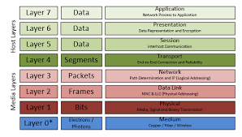

# OSI Model :
- Standardised framework to define a network communication
- A system to breakdown network communication
- Defined by International Organisation of Standards
- Idea is to avoid proprietery systems and inter-operability between vendors
- Useful for network trouble shooting

## OSI Layers :

